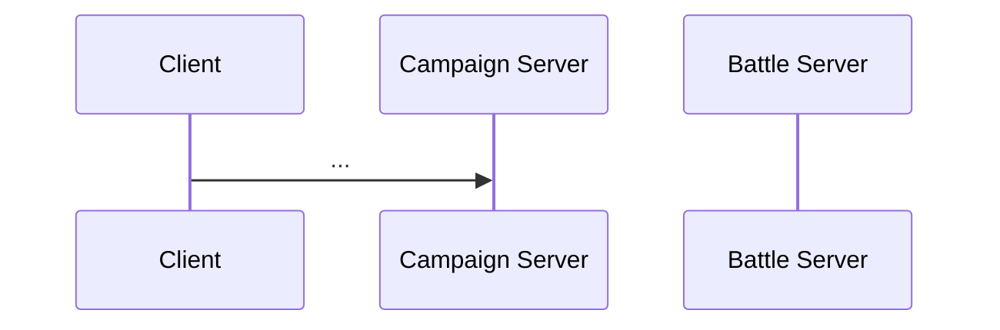

# Flow: <name>

**Status:** DRAFT | AUDITED
**Validated against commit:** `<sha>`

## Scope

What this flow covers. Entry points (what starts it) and exit points (what
state it leaves behind). One paragraph.

## Sequence diagram

## Code anchors

Every step of the flow, in order. Re-verify line numbers with `grep -n`
before editing this table; the Symbol column is the durable key.

| # | Step | File | Line | Symbol |
|---|------|------|------|--------|
| 1 | ... | `wse2work/Native-Coop-master/module_coop_scripts.py` | 9056 | `coop_write_battle_data` |

## State & events

- **Dict keys / files:** ...
- **Slots / globals:** ...
- **Network events:** channel/ID/name for every event this flow uses.

## Invariants

Rules that must hold, one bullet each, with the anchor that enforces it.

## Audit: ours vs. native

| # | Behavior | Ours (anchor) | Native ground truth (evidence) | Verdict |
|---|----------|---------------|--------------------------------|---------|
| 1 | ... | ... | RE findings citation (workbench `patches/<proj>/findings.md#...`) or module anchor — always summarize the finding inline | OK / DIVERGES / UNKNOWN |

Verdict rules: OK = matches or intentionally diverges (cite intent).
DIVERGES = undocumented difference -> fix-list entry. UNKNOWN = not yet
verified -> must be resolved or parked in Open Questions.

## Fix list

| # | From audit row | What diverges | Suggested owner/layer |
|---|----------------|---------------|------------------------|

## Open questions

Parked UNKNOWNs, each with one line on why it was parked.

## Related docs

Links to other dossiers first, then workbench sources (`patches/*/findings*.md`,
RE docs, design specs) under a "Workbench documents" note — see any existing
dossier for the pattern.
