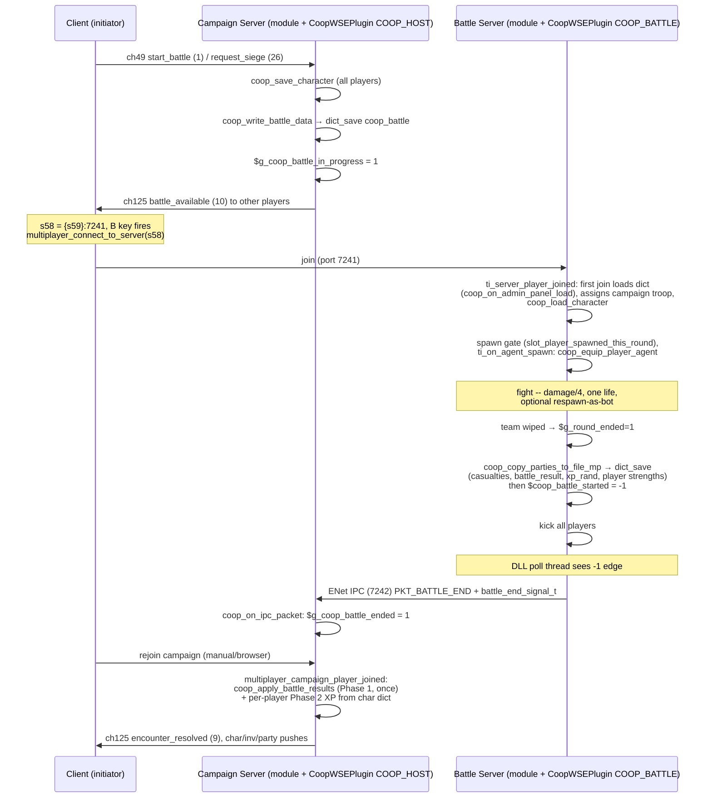

# Flow: Battle Pipeline (dedicated battle end-to-end)

**Status:** AUDITED
**Validated against commit:** `a68b8ae`

## Scope

The dedicated coop battle: a client on the campaign server requests a battle
from an encounter, the campaign server serializes the encounter into
`coop_battle.wsedict` and announces it, players B-key-join the battle server,
fight one life, the battle server writes results back into the dict and
signals the campaign server over ENet IPC, and rejoining players get
casualties + XP applied to their campaign parties. Entry point: channel-49
`start_battle`/`request_siege` (client). Exit state: casualties and XP applied,
char dicts saved, `encounter_resolved` pushed to the initiating client.
Local SP-style fights (events 16/17) share only the casualty core; they are
covered in `xp-sync.md`. Siege-specific mission behavior is in `siege.md`.

Module paths below are relative to `wse2work/Native-Coop-master/`; C paths
relative to repo root.

## Sequence diagram

## Code anchors

| # | Step | File | Line | Symbol |
|---|------|------|------|--------|
| 1 | Client battle request arm (ch49 ev 1) | `module_coop_scripts.py` | 8554 | `multiplayer_campaign_client_events` |
| 2 | Siege request arm (ch49 ev 26) | `module_coop_scripts.py` | 8600 | same dispatcher |
| 3 | Pre-battle save of all connected chars | `module_coop_scripts.py` | 8571–8575 | `script_coop_save_character` loop |
| 4 | Encounter serialization to dict | `module_coop_scripts.py` | 9056 | `coop_write_battle_data` |
| 5 | — scene selection (siege slots / terrain) | `module_coop_scripts.py` | 9080–9143 | |
| 6 | — battle advantage (`allies*15/enemies-15`) | `module_coop_scripts.py` | 9152–9163 | `@battle_adv` |
| 7 | — garrison keys for sieges | `module_coop_scripts.py` | 9177–9193 | `@p_garrison`, `@p_castle_lord` |
| 8 | — enemy stacks (alive only) | `module_coop_scripts.py` | 9217–9225 | `@p_enemy0_{i}_trp/num` |
| 9 | — ally stacks skip stack 0 (leader) | `module_coop_scripts.py` | 9235–9250 | `@p_ally0_{i}_trp/num` |
| 10 | battle_available broadcast (ch125 ev 10) | `module_coop_scripts.py` | 8586, 8625 | |
| 11 | Client recv ev 10: arm B-key, s58 | `module_coop_scripts.py` | 8427–8431 | `multiplayer_campaign_server_events` |
| 12 | B-key auto-connect trigger | `module_simple_triggers.py` | 48–57 | `multiplayer_connect_to_server` |
| 13 | Battle server: join handler | `module_coop_mission_templates.py` | 424–467 | `ti_server_player_joined` |
| 14 | — dict load on first join | `module_coop_mission_templates.py` | 434 | `script_coop_on_admin_panel_load` (def `module_coop_scripts.py:85`) |
| 15 | — campaign troop + char load | `module_coop_mission_templates.py` | 462–464 | `script_coop_load_character` |
| 16 | One-life spawn gate | `module_coop_mission_templates.py` | 557–576 | `slot_player_spawned_this_round` |
| 17 | Bot reinforcement spawn | `module_coop_mission_templates.py` | 662–773 | `script_coop_find_bot_troop_for_spawn` (def `module_coop_scripts.py:3780`) |
| 18 | Agent spawn: formation + campaign equip | `module_coop_mission_templates.py` | 829–893 | `script_coop_spawn_formation` (def `:3461`), `script_coop_equip_player_agent` (def `:3025`) |
| 19 | Player damage quartered | `module_coop_mission_templates.py` | 160–177 | `coop_server_reduce_damage` |
| 20 | Death: respawn-as-bot (optional) | `module_coop_mission_templates.py` | 88–149 | `coop_respawn_as_bot` |
| 21 | Per-death casualty recording | `module_coop_mission_templates.py` | 901 | `script_coop_server_on_agent_killed_or_wounded_common` (def `module_coop_scripts.py:3871`) |
| 22 | Battle end detection (team wipe) | `module_coop_mission_templates.py` | 896–949 | `$coop_alive_team1/2`, `$g_round_ended` |
| 23 | Dedicated end: results write + kick all | `module_coop_mission_templates.py` | 957–990 | `script_coop_copy_parties_to_file_mp` (def `module_coop_scripts.py:4634`) |
| 24 | — casualty keys written | `module_coop_scripts.py` | 4689, 4713 | `coop_battle_dict_put_stack_cas` (def `:6538`) |
| 25 | DLL: poll thread sees `$coop_battle_started == -1` | `src/coop_campaign.c` | 1471–1513 | `battle_poll_thread_func` |
| 26 | DLL: collect + IPC END | `src/coop_campaign.c` | 1419–1456 | `battle_collect_and_save`, `battle_end_signal_t` (`src/shared/battle_ipc.h:26`) |
| 27 | Campaign DLL: END -> module global | `src/coop_campaign.c` | 1627–1647 | `coop_on_ipc_packet` sets `$g_coop_battle_ended=1` (`:1636`) |
| 28 | Rejoin: results applied | `module_coop_scripts.py` | 8171–8176 | `multiplayer_campaign_player_joined` (def `:8148`) |
| 29 | Results core (once, gated on `end_mp`) | `module_coop_scripts.py` | 9274 | `coop_apply_battle_results` |
| 30 | — enemy casualties, hero wound 40–70 | `module_coop_scripts.py` | 9318–9346 | |
| 31 | — Phase 1 XP pool + per-player stash | `module_coop_scripts.py` | 9354–9428 | `coop_compute_sp_xp_pool_from_dict` (def `:9488`) |
| 32 | — ally casualties via casualty core | `module_coop_scripts.py` | 9440–9451 | `coop_apply_player_stack_casualty` (def `:7003`) |
| 33 | — encounter_resolved push (ch125 ev 9) | `module_coop_scripts.py` | 9471 | |
| 34 | Phase 2 per-player pending XP on rejoin | `module_coop_scripts.py` | 8185–8219 | `coop_apply_xp_shares` (def `:9524`) |
| 35 | Campaign join trigger | `module_simple_triggers.py` | 4410–4415 | `ti_server_player_joined` |
| 36 | IPC receive owner (campaign DLL) | `src/coop_campaign.c` | `coop_on_ipc_packet` | HELLO/END; the campaign-ENet battle handshake was deleted in B8 (`a68b8ae`) |

## State & events

- **Dict file:** `coop_battle.wsedict` — keys: `@battle_state` (see states
  below), `@battle_host_party`, `@battle_host_player_name`, `@map_type`
  (battle type), `@map_scn/castle/street/party_id`, `@map_time/cloud/haze/rain`,
  `@battle_adv`, `@tm0_fac/@tm1_fac/@tm1_name`, `@p_garrison`,
  `@p_castle_lord`, `@p_garrison_banner`, `@srvr_set0..11`,
  `@num_parties_enemy/ally`, `@p_enemy{i}_partyid/numstacks/{j}_trp/{j}_num`
  (same for ally), `@num_bots_team_1/2`, `@cls{i}_name`; post-battle:
  `@p_enemy{i}_numstacks_cas` + per-stack cas keys (via
  `coop_battle_dict_put_stack_cas`), `@battle_result`, `@battle_xp_rand`,
  `@battle_num_players`, `@battle_player_{i}_name/strength`.
- **Char dicts:** `coop_char_<name>.wsedict` — Phase 1 stashes
  `@char_battle_pending`, `@char_pending_party_xp`, `@char_pending_hero_xp`
  (preserved across concurrent saves by `coop_save_character:7073–7099`).
- **Globals:** `$g_coop_battle_in_progress` (campaign), `$g_coop_battle_ended`
  (written by DLL, consumed+cleared by module), `$g_coop_battle_available` /
  `s58`/`s59` (client B-key), `$coop_battle_started` (battle server:
  0 idle, 1 running, -1 dict-flushed), `$g_round_ended`, `$coop_winner_team`,
  `$coop_alive_team1/2`, `$coop_battle_state`.
- **Battle types (dict `@map_type`):** `module_constants.py:1994–1999`
  (field=1, siege attack/defend=2/3, village=4/5, bandit lair=6).
- **Battle states:** `module_constants.py:2002–2008` — none=0, setup_sp=1,
  setup_mp=2, started=3, **end_mp=4** (gates result apply), end_sp=5,
  abandoned=6.
- **Network events:** ch49: `start_battle`=1, `request_siege`=26,
  `leave_encounter`=0 (`header_common.py:219–251`). ch125:
  `encounter_resolved`=9, `battle_available`=10, `return_to_campaign`=14
  (**dead — see audit row 7**) (`header_common.py:171–216`). ch126 battle
  events: `coop_event_*` (`module_constants.py:2015–2062`). ENet IPC
  (7242) — the only C-layer wire since B8 (`a68b8ae`):
  `PKT_BATTLE_HELLO` (0x26) + `PKT_BATTLE_END` (0x27) with
  `battle_end_signal_t` (`src/battle_ipc.h`); the type byte alone
  determines wire shape; battle server connects to `127.0.0.1:7242`
  only (`src/shared/battle_net.c:36–38`).

## Invariants

- `coop_apply_player_stack_casualty` (`module_coop_scripts.py:7003`) is the
  single owner of player-party battle-loss rules: MP-profile remap, clamp to
  what the party has, surgery saves, wound survivors, heroes never removed,
  `p_player_casualties` accounting. Both callers (dedicated ally loop `:9449`,
  local-fight arm) must go through it.
- Result application runs **once**: gated on `@battle_state == end_mp` and
  the state is cleared before applying (`:9290–9295`).
- Phase 1 (pool computation + stash) runs once per battle; Phase 2 (apply
  pending XP from char dict) runs on every rejoin and clears the pending
  flags before `coop_save_character` re-reads them from disk (`:8210–8219`).
- `coop_save_character` must preserve `@char_pending_*` keys it did not
  create (`:7073–7099`) — Phase 1 may stash for players who haven't rejoined.
- `$coop_battle_started = -1` must be assigned only **after** `dict_save`
  of the results (`module_coop_mission_templates.py:957–990`); the DLL treats
  the -1 edge as "dict is on disk".
- `pkt_write`/`pkt_read` frame ALL packets (`src/battle_ipc.h` since B8,
  `a68b8ae`): `[0]=type`, payload at `+PKT_HDR_SIZE`.
- The DLL never calls engine functions from the poll thread — raw reads with
  SEH guard (`src/coop_campaign.c`, battle poll thread).

## Audit: ours vs. native

| # | Behavior | Ours (anchor) | Native ground truth (evidence) | Verdict |
|---|----------|---------------|--------------------------------|---------|
| 1 | Player-party casualty math: surgery re-roll saves a dead unit as wounded at **`P = 0.25 + 0.04 × surgery`** (`:wound_pct = 25 + skl×4`, capped 100); wounded survive; player heroes never removed; enemy heroes wounded 40–70 HP loss. Fixed in `50f4ac1`, runtime-verified 2026-07-10 | `module_coop_scripts.py:7072–7077` (@ `fc1f204`) | RE'd (`patches/Warband/findings.md` "Native kill-vs-wound (surgery) rules", resolver `0x4BB310`): native real-battle/encounter path saves each removed unit as wounded at **`P = 0.25 + 0.04 × surgery`** (constants `0.25`@0x7C1610, `0.04`@0x7C5408), and forces heroes to wounded (`tf_hero` at 0x4BC8EB). Coop now matches base, slope, and the hero rule. Separately, native's bulk `inflict_casualties_to_party_group` opcode (0x54FF80) uses a flat 35% wound / no surgery — coop does not route through it, so that rule is not the relevant baseline. | OK |
| 2 | Post-battle XP pool `(level+10)^2/10` per casualty, cap 40000, × `@battle_xp_rand`/100; split by per-player strength; host share -> `party_add_xp`, joiner share -> hero only | `module_coop_scripts.py:9488–9516`, `:9376–9422`, `:9524–9561` | Native `party_give_xp_and_gold` (`module_scripts.py:15341–15390`) uses the same basis (`p_total_enemy_casualties`, victory call site `module_game_menus.py:4674`) and same per-stack formula + 40000 cap + rand 50–99 roll. Deltas: native scales by `$g_strength_contribution_of_player` **before** the cap, coop caps the raw pool before the strength split; coop's shared roll is 50–100 (`store_random_in_range 50,101` at `:4734`) vs native 50–99. Both are minor and the multi-player split is the intended design. **Native also pays gold (loot share × rand, split among heroes) — coop pays none; tracked under row 6.** | OK |
| 3 | Battle end = team wipe only (`$coop_alive_team1/2 == 0` recount on each death); no settle delay, no retreat, no hero-fallen case, reserves ignored | `module_coop_mission_templates.py:896–949` | Native `common_battle_check_victory_condition` (`module_mission_templates.py:889–905`): mission time ≥ 10s + `all_enemies_defeated(5)` + `neg|main_hero_fallen`. RE'd (`patches/Warband/findings.md` "all_enemies_defeated opcode semantics", helper `0x00547FE0`): the opcode is **also** a live-agents-only snapshot — but its parameter is a settle delay in seconds since the last agent status change, so any reinforcement spawn within 5s resets the window. Coop's instant-wipe check has no settle delay: a team with unspawned waves loses the moment its on-field agents hit zero. Note: the opcode keys off the local player agent and returns FALSE unconditionally on a dedicated server (`mission+0x94 == -1`), so coop could not have reused it server-side — the module-side recount is the right architecture, it just needs reserve/settle logic. | DIVERGES |
| 4 | Spawn: fixed entry-point table per battle type + optional line formation; campaign equip via `coop_equip_player_agent` | `module_coop_mission_templates.py:336–409`, `:726–757`, `:829–893` | Native `lead_charge` uses `mtef_attackers`/`mtef_defenders` team entry flags and engine-standard entry points (`module_mission_templates.py:2218–2244`). Coop's explicit per-battle-type entries + `coop_spawn_formation` are an intentional, admin-panel-configurable MP feature (ch126 `coop_event_spawn_formation`). | OK |
| 5 | One life via spawn gate; death -> optional bot control; all players kicked at battle end | `module_coop_mission_templates.py:557–576`, `:88–149`, `:972–976` | Parked — see Open questions. | PARKED |
| 6 | Encounter resolution: `@battle_result` -> `$g_battle_result` + routed counts, `encounter_resolved` push; **no loot, no gold, no prisoners, no political consequences**. The battle-disengage half is FIXED + runtime-verified 2026-07-11 (`f85c30e` + `d865990`): the apply tail now releases every dict enemy party from the stale battle association, and on victory clears + `remove_party`s non-center parties, then disengages the (rebuilt) player party. Key mechanism: the rejoining player gets a REBUILT party, so `party_get_battle_opponent` finds nothing — enemy parties must be resolved via the dict `@p_enemy{i}_partyid` | `module_coop_scripts.py` `coop_apply_battle_results` tail | Native victory chain (`module_game_menus.py:4664–4690`): `party_calculate_loot` + loot screen, `party_give_xp_and_gold` (XP **and** hero gold shares), `battle_political_consequences`, `event_player_defeated_enemy_party`, `clear_party_group`. Coop applies XP only — loot/gold/prisoners/political remain the open A7 gap. | DIVERGES |
| 7 | ch125 event 14 `return_to_campaign` constant deleted (`1dc8fec`) — it was never sent or handled; project-state row corrected (ID 14 marked free). Smoke passed 2026-07-11 | `header_common.py` (ID 14 free note) | Confirmed by exhaustive grep of module + C source before removal | OK |
| 8 | Dead `s57` reconnect write deleted from the ASI (`fd0e088`) — nothing consumed it and vanilla scripts clobber `s57` as a scratch register. The live `s59` battle-server-IP write remains. Smoke passed 2026-07-11 | `src/asi/coop.c` `s59_writer_thread` | Confirmed by grep: no consumer in module or src before removal | OK |
| 9 | Legacy `coop_battle.c` orchestration excised (`fd0e088`): file deleted along with the WSELoaderServer spawn, `battle_result.txt` file IPC, Attack-click launch call-site patch, `PKT_BATTLE_START`/`RESULT`, and the party-slot 108–110 result delivery. One orchestration path remains: the ENet-IPC dedicated-server pipeline. Kept live at the time: campaign-ENet INVITE/ACCEPT/DECLINE/RESUME handshake + tick pause and the initiate/cleanup_battle hooks — since deleted in B8 (`a68b8ae`, verified inert); the surviving C layer is the COOP_BATTLE poll thread + `PKT_BATTLE_END` (IPC, 0x27 since `0153ecf`). Smoke 2026-07-11: full chain verified in logs (`battle_started -> -1` → `PKT_BATTLE_END` → `$g_coop_battle_ended = 1` → results applied) | `src/coop_campaign.c`; `src/battle_ipc.h` | The candidate-10 `coop_net`/`battle_net` twin question was closed by deletion in B8 (`a68b8ae`): `coop_net.c` is gone, `battle_net.c` is the sole ENet wrapper | OK |

## Fix list

| # | From audit row | What diverges | Suggested owner/layer |
|---|----------------|---------------|------------------------|
| 0 | 1 | ~~Surgery save omits native's 0.25 base~~ Fixed (`50f4ac1`) + runtime-verified 2026-07-10: `coop_apply_player_stack_casualty` rolls `25 + skl×4` percent, capped 100. | `module_coop_scripts.py:7072–7077` |
| 1 | 7 | ~~Dead ev 14 `return_to_campaign`~~ **Done** (`1dc8fec`, smoke 2026-07-11): constant removed, project-state row corrected. | `header_common.py` + `.claude/rules/project-state.md` |
| 2 | 8 | ~~Dead `s57` reconnect write~~ **Done** (`fd0e088`, smoke 2026-07-11): write deleted; auto-rejoin, if ever wanted, gets its own design. | `src/asi/coop.c` |
| 3 | 3 | Round-end check is reserve-blind and instant: consult remaining temp-party reserves and/or add a native-style settle delay (seconds since last spawn/death) before declaring the round over. Native's `all_enemies_defeated` cannot be reused server-side (returns FALSE with no local player agent) — extend the module-side check instead. There is also no retreat path. | `module_coop_mission_templates.py` end trigger (`:896–949`) |
| 4 | 6 | Victory pays XP only. Native also pays hero gold shares, runs loot calculation/screen, and applies `battle_political_consequences` + `event_player_defeated_enemy_party`. Decide which consequences coop should port (gold at minimum) and add them to `coop_apply_battle_results`. ~~Urgent sub-piece: server-side battle disengage + beaten-party removal~~ **Done** (`f85c30e` + `d865990`, runtime-verified 2026-07-11) — resolved via dict party ids; the ev-17 local arm got the same `remove_party` treatment (`d82d879`, local win not yet re-smoked). | `module_coop_scripts.py` BATTLE PIPELINE section |
| 5 | 9 | ~~Legacy `coop_battle.c` orchestration~~ **Done** (`fd0e088`, smoke 2026-07-11): excised (see audit row 9). Candidate 10 (`coop_net`/`battle_net` merge) remains deferred. | `src/coop_campaign.c` + `src/battle_ipc.h` |

## Open questions

- Audit row 5 (engine per-player mission state after the end-of-battle mass
  kick): parked — impact is bounded because the battle server immediately
  restarts its mission and clients fully reconnect to the campaign server;
  the wave-2 runtime smoke test (`docs/NEXT_SESSION.md`) exercises exactly
  this path and is the cheaper verification.

## Related docs

- `docs/BATTLE_RESULTS_PIPELINE_AUDIT.md` — earlier results-pipeline audit.
- `docs/superpowers/specs/2026-03-22-warband-coop-campaign-sync-design.md`.
- `patches/WarbandDedicated/kb.h` / `findings.md` — campaign-server binary RE.
- `docs/NEXT_SESSION.md` (wave-2) — handshake + casualty-core changes this
  dossier reflects.
