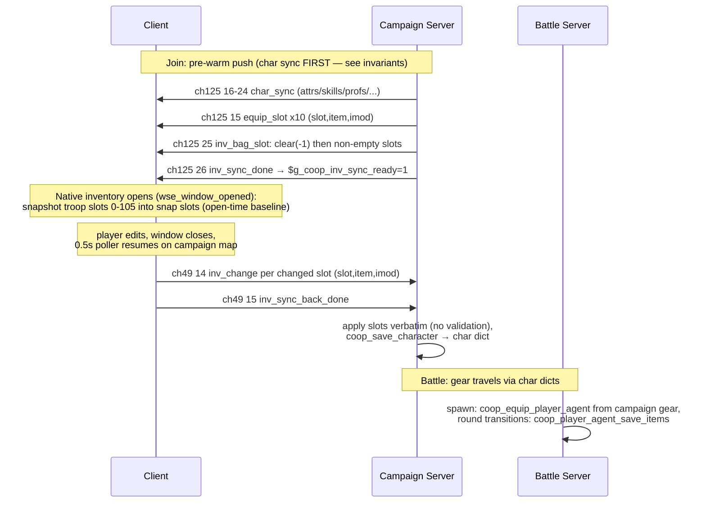

# Flow: Inventory Sync (equip pushes, bag sync, screen close-diff)

**Status:** AUDITED
**Validated against commit:** `d05ef59` (audit row 6 fix + join-push
ordering runtime-verified 2026-07-10; group-C fixes for rows 4/5 smoke
passed 2026-07-11)

## Scope

How a player's equipment (slots 0–9) and bag (slots 10–105) stay in sync
between the campaign server's authoritative troop struct and the client's
native inventory screen, and how gear reaches the battle server. Entry
points: campaign join (pre-warm push), native inventory window open/close,
battle spawn. Exit state: server troop + `coop_char_<name>.wsedict` reflect
client edits. The trade screen has its own synced flow (ch49 ev 20–22 /
ch125 ev 29–32) and is out of scope here.

Module paths relative to `wse2work/Native-Coop-master/`.

## Sequence diagram

## Code anchors

| # | Step | File | Line | Symbol |
|---|------|------|------|--------|
| 1 | Equip push on join (ev 15) | `module_coop_scripts.py` | 9637–9646 | `coop_send_equipment_to_client` |
| 2 | Bag push on join (ev 25/26, clear signal, non-empty only) | `module_coop_scripts.py` | 9648–9676 | `coop_send_inventory_to_client` |
| 3 | Push call sites (join) | `module_coop_scripts.py` | 8221–8222 | `multiplayer_campaign_player_joined` |
| 4 | Client equip recv (troop struct + mirror) | `module_coop_scripts.py` | 8448–8459 | ev 15 arm (mirror writes raw slots 0–19 — see audit row 4) |
| 5 | Client bag recv + sync-ready flag | `module_coop_scripts.py` | 6839–6861 | `coop_client_recv_inventory` (`$g_coop_inv_sync_ready`) |
| 6 | Open-time snapshot baseline | `module_scripts.py` | 51154–51188 | `wse_window_opened` (window_inventory arm) |
| 7 | Presentation-side baseline (coop item select) | `module_presentations.py` | 13630–13660 | on `$g_coop_inv_sync_ready` |
| 8 | Close-diff + send (equip then bag) | `module_simple_triggers.py` | 4541–4600 | 0.5s poller, ev 14 per changed slot, ev 15 done |
| 9 | Server apply (no validation) + save | `module_coop_scripts.py` | 8759–8771 | ev 13/14/15 arms |
| 10 | Char dict save/load carries imod | `module_coop_scripts.py` | 7162–7173, 7380–7399 | in `coop_save_character` / `coop_load_character` |
| 11 | Battle server: pre-spawn inventory access | `module_coop_scripts.py` | 2973–3001 | `coop_player_access_inventory` |
| 12 | Battle server: spawn equip from campaign gear | `module_coop_scripts.py` | 3025–3044 | `coop_equip_player_agent` |
| 13 | Battle server: persist agent items at round transition | `module_coop_scripts.py` | 3002–3024 | `coop_player_agent_save_items` |
| 14 | Battle server: item-bug guard | `module_coop_scripts.py` | 3045–3087 | `coop_check_item_bug` |

## State & events

- **Events:** ch125: `equip_slot`=15, `inv_bag_slot`=25, `inv_sync_done`=26;
  ch49: `request_inv_sync`=13 (**dead — no sender**, see audit row 5),
  `inv_change`=14, `inv_sync_back_done`=15 (`header_common.py`).
- **Client globals:** `$g_coop_inv_screen_open` (0 idle / 1 open / 2 close
  processed; set by `wse_window_opened`), `$g_coop_inv_sync_ready`.
- **Snapshot slots** on `trp_temp_troop`: equip items 160–169, equip mods
  170–179, bag items 180–275, bag mods 276–371
  (`module_constants.py:1944–1947`).
- **Dict:** equipment + bag with imods persisted per player in
  `coop_char_<name>.wsedict` by `coop_save_character`.

## Invariants

- Slots 0–9 are equipment, 10–105 bag; the bag push sends a clear signal
  (slot −1) before non-empty slots to purge stale client state without
  overflowing the send buffer (`:9654–9660`).
- Every `inv_sync_back_done` triggers a char-dict save — client edits are
  never left memory-only on the server (`:8770–8771`).
- Simple triggers pause during native windows, so `open==1` observed by the
  poller means "the screen just closed" (`module_simple_triggers.py:4541`).
- Item modifiers travel with every hop: ev 14/15/25 payloads and the char
  dict all carry imod.
- **Join push order: char sync before inventory.** The engine bounds
  `troop_set_inventory_slot` by `getNumInventorySlots()+10` — skill-derived
  (`30 + 6*IM` for hero troops), silent no-op out of range
  (`patches/Warband_WSE2/findings.md` "troop inventory slot bounds"). If bag
  slots arrive before the skill push raises the client troop's IM, the
  IM-bonus slots (e.g. 40–45 at IM 1) are dropped client-side — items
  "disappear on rejoin" while remaining in the server dict. Fixed by
  reordering `multiplayer_campaign_player_joined` pushes (char sync →
  equipment → inventory), mirroring `coop_load_character`'s skills-before-bag
  order; runtime-verified 2026-07-10.

## Audit: ours vs. native

| # | Behavior | Ours (anchor) | Native ground truth (evidence) | Verdict |
|---|----------|---------------|--------------------------------|---------|
| 1 | Server-side inventory mutations (quest rewards, script grants) are pushed to the client only on join/rejoin — there is no push-on-mutation path | pushes exist only at `:8221–8222` (join) | The mod's own authority model ("clients receive pushes", `.claude/rules/project-state.md`) implies server mutations should reach a live client; in native SP the question doesn't arise (single process). A client's inventory screen can show stale state until rejoin. | DIVERGES |
| 2 | Close-diff baseline is an **open-time snapshot of the client troop**, ungated | `module_scripts.py:51154–51188`; differ at `module_simple_triggers.py:4544–4600` has no ready-gate | The char-sync flow implements the documented lesson ("baseline must come from receive handlers, not client troop") with a `snap_ready` gate (`module_coop_scripts.py:6817–6821`); the inventory flow predates/skips it. A server push landing while the screen is open gets echoed back as a client edit (benign echo today only because pushes never occur mid-session — see row 1). | DIVERGES |
| 3 | Battle equip: gear rebuilt from campaign state on spawn; consumables not decremented in campaign inventory after battle | `module_coop_scripts.py:3025–3044`, `:3002–3024` | Native refills ammo/consumables after battles (campaign inventory is not charge-tracked) — rebuilding from campaign state yields the same net behavior | OK |
| 4 | Orphaned raw-slot 0–19 mirror deleted from the ev-15 recv arm (`1dc8fec`); the troop-struct writes that feed the native inventory screen remain. Smoke passed 2026-07-11 | ev-15 recv arm, `module_coop_scripts.py` | The actual diff baseline lives at slots 160–179 (`module_constants.py:1944–1945`), written by `wse_window_opened`/presentation — nothing read the raw-slot mirror | OK |
| 5 | ch49 ev 13 `request_inv_sync` constant + handler deleted (`1dc8fec`) — no sender existed; inventory is pre-warmed on join. Project-state row corrected (ID 13 marked free). Smoke passed 2026-07-11 | `header_common.py` (ID 13 free note) | If B2 (push-on-mutation) ever needs a client re-request, add one deliberately in that design | OK |
| 6 | Server applies `inv_change` verbatim — any item/imod a client names lands in the server troop and is persisted | `module_coop_scripts.py:8762–8768` | Violates the mod's server-authoritative design statement; a buggy or malicious client can mint arbitrary items (contrast: battle drops are slot-guarded server-side, `coop_generate_item_drop:9704–9706` "we hold the item in a slot, server-side, to prevent funny business") | OK (fixed `50f4ac1`: `coop_inv_sync_back_validate_and_save` count-validates each batch against the pre-edit dict baseline, commits or reverts whole batch; runtime-verified 2026-07-10 — legit edits stick, no false `[INV GUARD]` rejects) |

## Fix list

| # | From audit row | What diverges | Suggested owner/layer |
|---|----------------|---------------|------------------------|
| 1 | 1 | No push-on-mutation: add equip/bag pushes wherever server-side scripts mutate a player troop's inventory (or a periodic dirty-flag push), so live clients don't go stale until rejoin. | `module_coop_scripts.py` ECONOMY/MISC push helpers |
| 2 | 2 | Move the inventory diff baseline to receive handlers + add a ready-gate, mirroring the char-sync pattern (removes the mid-session-push echo race and aligns with the documented lesson). | `module_scripts.py` `wse_window_opened` + `module_coop_scripts.py` recv arms |
| 3 | 4 | ~~Orphaned raw-slot 0–19 mirror~~ **Done** (`1dc8fec`, smoke 2026-07-11): deleted; troop-struct writes kept. | `module_coop_scripts.py` ev-15 recv arm |
| 4 | 5 | ~~Dead ev 13~~ **Done** (`1dc8fec`, smoke 2026-07-11): constant + handler removed, project-state row corrected. B2 re-adds a re-request only if its design needs one. | `header_common.py` + `module_coop_scripts.py` + `.claude/rules/project-state.md` |
| 5 | 6 | ~~Validate `inv_change` server-side~~ **Done** (`50f4ac1`, runtime-verified 2026-07-10): batch count-validation against the pre-edit dict baseline in `coop_inv_sync_back_validate_and_save`, whole-batch revert + re-push on violation. | `module_coop_scripts.py` ev-14/15 arms |

## Open questions

None — all audit rows resolved module-side (native screen internals were
already covered by `docs/RE_NATIVE_SCREENS.md`; no new engine RE required).

## Related docs

- `docs/RE_NATIVE_SCREENS.md`, `docs/SP_SCREEN_RECREATION.md` — native
  window hook RE (source of the `wse_window_opened` mechanism).
- `docs/superpowers/plans/2026-04-14-native-inventory-screen.md`.
- `xp-sync.md` — shared snapshot-slot machinery on `trp_temp_troop`.
- Trade flow (ch49 20–22 / ch125 29–32): separate concern, no dossier yet.
