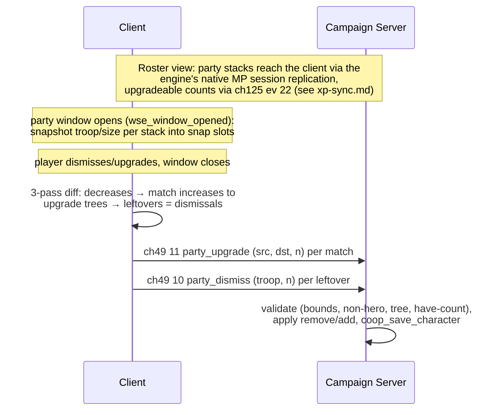

# Flow: Party Screen Sync (roster, dismiss, upgrade)

**Status:** AUDITED
**Validated against commit:** `a68b8ae`

## Scope

How player-party roster edits made in the native party screen (dismissals
and upgrades) reach the authoritative campaign-server party, and how the
client's view of its roster is populated. Entry points: native party window
open/close. Exit state: server party mutated, char dict saved. Recruitment
(ch49 ev 23 / ch125 ev 33–34) is center-flow territory; the battle-server
temp-party sorting is battle machinery — both only referenced here.

Module paths relative to `wse2work/Native-Coop-master/`.

## Sequence diagram

## Code anchors

| # | Step | File | Line | Symbol |
|---|------|------|------|--------|
| 1 | Party snapshot at window open | `module_scripts.py` | 51190–51230 | `wse_window_opened` (window_party arm), `$g_coop_party_screen_open` |
| 2 | Close-diff pass 1: decrease deltas | `module_simple_triggers.py` | 4448–4466 | snap slots `slot_coop_party_snap_begin` + stride |
| 3 | Close-diff pass 2: upgrades matched via `troop_get_upgrade_troop` | `module_simple_triggers.py` | 4469–4513 | sends ch49 ev 11 |
| 4 | Close-diff pass 3: leftover decreases -> dismissals | `module_simple_triggers.py` | 4515–4525 | sends ch49 ev 10 |
| 5 | Server dismiss arm (validated) | `module_coop_scripts.py` | 8715–8729 | bounds 1–100, non-hero, have-count, save |
| 6 | Server upgrade arm (validated) | `module_coop_scripts.py` | 8730–8757 | upgrade-tree check, bounds, have-count, save |
| 7 | Upgradeable counts push | `module_coop_scripts.py` | 9678–9693 | `coop_send_party_xp_to_client` (ch125 ev 22, see `xp-sync.md`) |
| 8 | Char dict party codec (troop, size, wounded) | `module_coop_scripts.py` | 7210–7230 | in `coop_save_character` (`:7217` wounded) |
| 9 | Battle-server temp-party sort (round transitions only) | `module_coop_scripts.py` | 3987–4020 | `coop_sort_party` (callers `module_coop_mission_templates.py:5214,5219`) |

## State & events

- **Events:** ch49: `party_sync_begin`=8, `party_sync_stack`=9 (**both dead —
  no senders, no handlers**, see audit row 4), `party_dismiss`=10,
  `party_upgrade`=11; ch125: `party_stack_xp`=22 (upgradeable counts)
  (`header_common.py:227–230`).
- **Client globals/slots:** `$g_coop_party_screen_open` (0/1/2 lifecycle),
  party snapshot at `slot_coop_party_snap_begin` + 3-slot stride
  (troop, size, decrease-delta) on `trp_temp_troop`.
- **Roster source:** client party stacks are populated by the engine's
  native MP session replication — not by any ch49/ch125 event. (Earlier
  revisions credited the C-layer `PKT_SNAPSHOT`/`PKT_DELTA` stream; that
  channel never functioned in the dedicated topology and was retired in
  B8, `a68b8ae`.)
- **Persistence:** stacks with wounded counts in `coop_char_<name>.wsedict`.

## Invariants

- The party diff never trusts raw increases: an increase is only sent if it
  matches a snapshot decrease through `troop_get_upgrade_troop` — anything
  else is silently dropped client-side (`module_simple_triggers.py:4469–4513`).
- Server arms re-validate independently (bounds 1–100, non-hero, upgrade
  tree, have-count) — client and server checks are intentionally redundant
  (`module_coop_scripts.py:8715–8757`).
- Every accepted dismiss/upgrade ends in `coop_save_character` — roster
  changes are never memory-only.
- Wounded counts survive the char-dict round trip (`:7217`, `:7226`).

## Audit: ours vs. native

| # | Behavior | Ours (anchor) | Native ground truth (evidence) | Verdict |
|---|----------|---------------|--------------------------------|---------|
| 1 | Upgrade structure: tree-validated (both branches), count-bounded, non-hero, have-count-checked on the server | `module_coop_scripts.py:8730–8757` | Same legality rules the native party screen enforces (`troop_get_upgrade_troop` is the same source of truth) | OK |
| 2 | Upgrade **cost**: server charges the native gold cost (`game_get_upgrade_cost` × count) before applying and rejects unaffordable requests, so the server gold push no longer refunds the client's local charge. Fixed in `50f4ac1`, runtime-verified 2026-07-10. Residual nuance: stack upgrade XP (`num_upgradeable`) is still not decremented server-side — the native screen enforces it client-side, but a modified client could upgrade without upgrade XP (gold is still charged) | `module_coop_scripts.py:8865–8875` (@ `fc1f204`) | Native upgrades consume stack upgrade XP and charge gold in the engine party screen. Coop now matches on gold; upgrade-XP consumption remains client-enforced only. | OK |
| 3 | Dismiss: non-hero, bounded, have-count-checked; no other consequences | `:8715–8729` | Native party-screen dismissal likewise has no gold/morale consequence for regulars; heroes can't be dismissed this way in native either | OK |
| 4 | ch49 ev 8/9 `party_sync_begin`/`party_sync_stack` constants deleted (`1dc8fec`) — they had no sender and no handler; project-state row corrected (IDs 8-9 marked free). Smoke passed 2026-07-11 | `header_common.py` (ID 8-9 free note) | Roster syncs via the engine's native MP replication (the C-layer snapshot/delta stream was retired in B8) | OK |
| 5 | Roster injection: client cannot add stacks via the diff (drop rule, invariant 1); raw ev-11 forgeries are limited to legal upgrade edges by server validation | `module_simple_triggers.py:4469–4513`; `module_coop_scripts.py:8730–8757` | Matches the server-authoritative design intent — except the free-cost hole in row 2 | OK |
| 6 | Party size limit: server enforces no cap on upgrades/dismissals (they don't grow the party); recruit paths own the cap question | n/a for this flow | Native party size limit is leadership/renown-driven and enforced at recruitment time — out of this flow's scope, owned by the recruit/center flow | OK |
| 7 | `coop_sort_party` orders battle-server temp parties only (spawn priority at siege round transitions) | `module_coop_scripts.py:3987–4020`; callers `module_coop_mission_templates.py:5214,5219` | Cosmetic/battle-internal; native party ordering rules don't apply to temp parties | OK |

## Fix list

| # | From audit row | What diverges | Suggested owner/layer |
|---|----------------|---------------|------------------------|
| 1 | 2 | ~~Upgrades are free~~ Gold cost fixed (`50f4ac1`) + runtime-verified 2026-07-10. Remaining (minor, authority-hardening): decrement stack upgrade XP server-side so a modified client can't upgrade without it. | `module_coop_scripts.py:8865–8875` ev-11 arm |
| 2 | 4 | ~~Dead ev 8/9~~ **Done** (`1dc8fec`, smoke 2026-07-11): constants removed, project-state table corrected. | `header_common.py` + `.claude/rules/project-state.md` |

## Open questions

- Whether native upgrades preserve wounded status on upgraded units (coop's
  remove+add yields healthy upgrades). Parked: minor gameplay nuance,
  cheapest to answer in the wave-2 runtime smoke test rather than engine RE.

## Related docs

- `docs/RE_NATIVE_SCREENS.md`, `docs/Screen_Session.md` — native window
  hooks behind `wse_window_opened`.
- `xp-sync.md` — ev 22 upgradeable push and snapshot-slot machinery.
- `.claude/rules/project-state.md` — C/DLL layer (IPC-only since B8).
