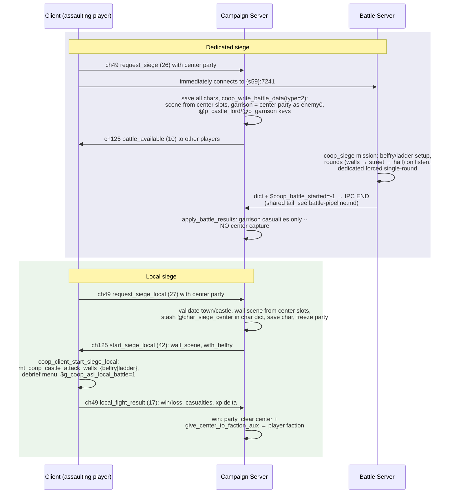

# Flow: Siege (coop siege battle types + local siege)

**Status:** AUDITED
**Validated against commit:** `d05ef59`

## Scope

How a coop player assaults a town/castle: the **dedicated siege** (battle
server runs the `coop_siege` mission) and the **local siege** (initiating
client fights an SP-style wall assault against AI, then reports the result).
Entry points: the coop center menu options `coop_center_assault` /
`coop_center_assault_local`. Exit state: garrison casualties applied (both
paths); center ownership transferred on local-siege win only (see audit).
The shared serialization/IPC/result tail is documented in
`battle-pipeline.md` — this dossier covers only the siege delta.

Module paths relative to `wse2work/Native-Coop-master/`; C paths relative to
repo root.

## Sequence diagram

## Code anchors

| # | Step | File | Line | Symbol |
|---|------|------|------|--------|
| 1 | Dedicated assault menu option | `module_game_menus.py` | 14790–14807 | `coop_center_assault` (sends ch49 ev 26, connects to `{s59}:7241`) |
| 2 | Local assault menu option | `module_game_menus.py` | 14809–14821 | `coop_center_assault_local` (sends ch49 ev 27) |
| 3 | Server arm: request_siege | `module_coop_scripts.py` | 8600–8629 | save chars, `coop_write_battle_data(type=2)`, battle_available |
| 4 | Server arm: request_siege_local | `module_coop_scripts.py` | 8741–8779 | wall scene from `slot_town_walls`/`slot_castle_exterior`, `@char_siege_center` stash via `coop_char_siege_center_set` (`:7558`), freeze party, ch125 ev 42 |
| 5 | Client local-siege launcher | `module_coop_scripts.py` | 6955–6993 | `coop_client_start_siege_local` -> `mt_coop_castle_attack_walls_{belfry\|ladder}` |
| 6 | Local siege client missions | `module_mission_templates.py` | 3232, 3309 | `coop_castle_attack_walls_ladder` / `_belfry` |
| 7 | Battle dict siege branch: scenes | `module_coop_scripts.py` | 9081–9098 | town: walls+castle+street slots; castle: exterior |
| 8 | Battle dict siege branch: garrison keys | `module_coop_scripts.py` | 9177–9193 | `@p_castle_lord`, `@p_garrison` (=0: enemy-party index), `@p_garrison_banner` from town lord |
| 9 | Dict loader battle-type branches | `module_coop_scripts.py` | 85, 136, 155 | `coop_on_admin_panel_load` (`$coop_battle_type`, `$coop_map_party`) |
| 10 | Battle server siege template | `module_coop_mission_templates.py` | 4500 | `coop_siege` |
| 11 | — siege join/bootstrap, belfry wheel init | `module_coop_mission_templates.py` | 4596–4649 | `$coop_use_belfry`, `multiplayer_initialize_belfry_wheel_rotations` |
| 12 | — round progression (listen mode) | `module_coop_mission_templates.py` | 5150–5232 | `$coop_round`, `coop_player_agent_save_items` (:5199), next scene by round (:5222–5228) |
| 13 | — dedicated forced single-round + end | `module_coop_mission_templates.py` | 5153–5157, 5265–5291 | |
| 14 | — belfry placement block | `module_coop_mission_templates.py` | 5391–5423 | `script_coop_move_belfries_to_their_first_entry_point` (def `module_coop_scripts.py:3187`) |
| 15 | — belfry crew assignment | `module_coop_mission_templates.py` | 5469 | `script_cf_coop_siege_assign_men_to_belfry` |
| 16 | Round-type / reserve constants | `module_constants.py` | 2101–2112 | `coop_reserves_hall/street`, `coop_round_*` |
| 17 | Local siege aftermath (event 17 arm) | `module_coop_scripts.py` | 9088–9110 | `coop_char_siege_center_get` + clear, capture on win: `party_clear` + `give_center_to_faction_aux` |
| 18 | Dedicated siege result apply (shared) | `module_coop_scripts.py` | 9274 | `coop_apply_battle_results` — garrison casualties via `@p_enemy0_partyid` = center party; **no capture logic** |

## State & events

- **Dict keys (siege delta):** `@map_type` ∈ {2 attack, 3 defend},
  `@map_scn` (walls), `@map_castle`, `@map_street`, `@map_party_id`
  (besieged center), `@p_castle_lord`/`@p_garrison` (enemy-party indices,
  0 for sieges, -1 for field), `@p_garrison_banner`.
- **Dict key:** `@char_siege_center` in the player's char dict — the
  locally-assaulted center; survives the client's disconnect AND the
  player_no/party reassignment on rejoin (preserved across
  `coop_save_character` rebuilds; helpers `coop_char_siege_center_set/_get`
  `module_coop_scripts.py:7558/:7573`; cleared by ev 16 and ev 17).
- **Slots:** `slot_center_coop_lock_player` — center encounter lock;
  `slot_center_siege_with_belfry` (`:261`) — picks belfry vs ladder variant;
  `slot_town_walls`/`slot_castle_exterior`/`slot_town_castle`/`slot_town_center`
  — scene sources.
- **Globals:** `$coop_round` (siege phase), `$coop_use_belfry`,
  `$belfry_positioned`, `$g_coop_asi_local_battle` (client),
  `$g_coop_center_party`/`$g_coop_center_type`/`$g_coop_center_scene`
  (client center-menu state).
- **Round types:** `coop_round_battle`=1, `stop_reinforcing_wall`=2,
  `town_street`=3, `stop_reinforcing_street`=4, `castle_hall`=5
  (`module_constants.py:2108–2112`); reserves: hall 20, street 80
  (`:2103–2104`).
- **Network events:** ch49 `request_siege`=26, `request_siege_local`=27,
  `local_fight_result`=17; ch125 `battle_available`=10,
  `start_siege_local`=42 (`header_common.py:216`, `:248–251`). Battle types:
  `module_constants.py:1995–1999`.

## Invariants

- The local-siege target lives in the **username-keyed char dict**
  (`@char_siege_center`) because the client disconnects into its local
  mission and rejoins with a NEW player_no and slot-derived party — player
  and party ids identify nothing across that boundary (runtime-proven:
  player 3/party 6 at assault became player 5/party 8 at result). A field
  local fight (ev 16) clears any stale stash so an abandoned siege can't
  be misread as a capture.
- The wall scene must be sent from the server (`:8662–8666`) — center party
  slots are not synced to clients.
- Dedicated siege is single-round by design gate (`:5153–5157`); multi-round
  progression (walls -> street -> hall) exists only in listen mode.
- Local-siege party freeze (`disable_party` `:8656–8661`) must be undone by
  rejoin/`enable_party` (`multiplayer_campaign_player_joined:8164`) or exit
  save (`multiplayer_campaign_player_exit:8250`).
- For sieges the besieged center **is** the serialized enemy party 0;
  garrison casualty application therefore mutates the center party directly
  (`coop_apply_battle_results` via `@p_enemy0_partyid`).

## Audit: ours vs. native

| # | Behavior | Ours (anchor) | Native ground truth (evidence) | Verdict |
|---|----------|---------------|--------------------------------|---------|
| 1 | Siege scene + variant: walls scene from `slot_town_walls`/`slot_castle_exterior`, belfry vs ladder from `slot_center_siege_with_belfry` | `module_coop_scripts.py:9086–9094`, `:8642–8651` | Identical sources to native: assault menus read `slot_town_walls`/`slot_castle_exterior` (`module_game_menus.py:5455–5457`, `:5815–5820`) and the belfry flag is the same slot native seeds at game start (`module_scripts.py:346–360`). Local-siege missions are literal copies of native `castle_attack_walls_{belfry,ladder}` with only a side-flag swap (`module_mission_templates.py:3222–3232`, `:3302–3309`). | OK |
| 2 | Belfry (dedicated `coop_siege`): pre-positioned at first entry point with `slot_scene_prop_belfry_platform_moved=1`; no push/rotate phase | `module_coop_mission_templates.py:5391–5423` (native trigger commented out at `:5391`), `:5469`; `module_coop_scripts.py:3187` | Native uses `common_siege_init_ai_and_belfry`/`_move_belfry`/`_rotate_belfry`/`_assign_men_to_belfry` (`module_mission_templates.py:981–1002`) — soldiers push the belfry to the wall. Coop deliberately replaces this (native triggers commented out, replacement block inline): belfries start at the wall, movement phase skipped. Intentional MP simplification. | OK |
| 3 | Defender composition: center party as enemy0 (garrison keys point there) plus every party attached to the center serialized as enemy1..N with per-party casualty round-trip via `@p_enemy{i}_partyid`; friendly AI parties within `coop_siege_join_radius` join as ally1..N (placeholder rule until a siege camp exists) | `coop_write_battle_data` roster sections + `script_coop_battle_dict_write_roster_party` | Native battles collect **attached parties** into the enemy side (`party_collect_attachments_to_party` -> `p_collective_enemy`, `module_game_menus.py:6045`, `:4247`). Coop now rosters them per-party (identity preserved for casualty apply-back — a collective party can't round-trip through the dict). Fixed `67239e5..d7955b7`, runtime-verified 2026-07-19 multi-client. Known follow-up: the attacker-side proximity filter is faction-relation-only and admits farmer/villager parties of unrelated at-war factions (tracked as an open follow-up) | OK |
| 4 | Multi-round siege (walls -> street -> hall) in listen mode; dedicated forced single-round | `module_coop_mission_templates.py:5150–5232`, `:5153–5157` | Dedicated single-round is documented in-code: "Dedicated siege v1 is single-round: the wall battle decides the siege" (`:5153–5155`). The multi-phase progression is inherited coop-mod (Banner Time) design, a deliberate extension over native's single-scene assault. | OK |
| 5 | Dedicated siege victory: garrison casualties applied, **center never changes hands** — no capture, no besieged-state cleanup | `module_coop_scripts.py:9274–9479` (no `give_center_*` call); only local siege captures (`:8980–8987`) | Native: successful assault transfers the center, handles lord capture/escape, prisoners, and post-siege menus | DIVERGES |
| 6 | Local siege victory: `party_clear` garrison + `give_center_to_faction_aux` to player faction — no other consequences. Capture itself runtime-verified 2026-07-10 (`[LOCAL SIEGE] center=310 win=1` → Ismirala Castle captured) after `13ebcad` re-keyed the target to `@char_siege_center` (the old party-slot mark stored a player_no that dies with the rejoin — capture never fired) | `module_coop_scripts.py:9088–9110` | Native `castle_taken` menu (`module_game_menus.py:6569–6640`): `party_clear` (matches), then `lift_siege`, `slot_center_last_taken_by_troop`, prosperity −5, renown +5, `faction_inflict_war_damage_on_faction` (20/40), full `give_center_to_faction` (lord/political handling, vs coop's low-level `_aux`), besieger guard order, keep-or-give-to-vassal menu. Coop skips all of these. | DIVERGES |
| 7 | Battle types `siege_player_defend` (3), `village_*` (4/5), `bandit_lair` (6) are defined and handled by the dict loader, but nothing ever launches them | `module_constants.py:1996–1999`; only callers pass types 1/2 (`module_coop_scripts.py:8578`, `:8617`) | Confirmed by exhaustive grep: no `coop_write_battle_data` caller uses types 3–6. Group-C resolution (`1dc8fec`): kept as future-feature scaffolding, documented as "defined, not yet launched" here and in project-state — the divergence was the docs overstating them, now corrected | OK |

## Fix list

| # | From audit row | What diverges | Suggested owner/layer |
|---|----------------|---------------|------------------------|
| 1 | 5 | Winning a dedicated siege does not capture the center: apply the same ownership transfer (and besieged-state cleanup) the local path does, driven from the battle result in `coop_apply_battle_results` (center party id is already in `@map_party_id`). | `module_coop_scripts.py` BATTLE PIPELINE section |
| 2 | 6 | Local-siege capture skips native consequences (lord fate, prisoners, relations). Decide the minimal native-parity set and port it; share it with the dedicated-path fix. | `module_coop_scripts.py` |
| 3 | 7 | ~~Dead battle types 3–6~~ **Done** (`1dc8fec`): kept as future-feature scaffolding, documented as "defined, not yet launched" (code untouched). Wire launch paths when the features are built. | `module_constants.py` + `module_coop_scripts.py` |
| 4 | 3 | ~~Attached defender parties excluded from the battle roster~~ **Done** (`67239e5..d7955b7`, runtime-verified 2026-07-19): attachments serialized as enemy1..N, proximity AI allies as ally1..N, casualties routed per party, markers on all rostered parties + startup sweep. Open refinement: tighten the attacker selection filter (farmer/random-faction parties currently pass — tracked as an open follow-up). | `module_coop_scripts.py` `coop_write_battle_data` |

## Open questions

None — all audit rows resolved module-side (no engine RE was required for
this flow).

## Related docs

- `battle-pipeline.md` — shared serialization, IPC, and result-apply tail.

Workbench documents (not part of the public export — see the citation
note in `README.md`):

- `docs/plans/siege-coop-plan.md` — earlier siege planning notes.
- `docs/superpowers/specs/2026-03-23-warband-coop-party-creation-design.md`
  — party-creation design notes.
