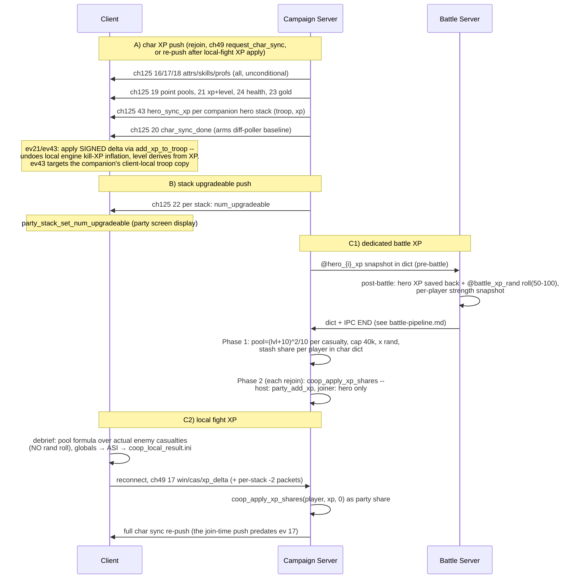

# Flow: XP Sync (char XP, stack upgrades, battle XP)

**Status:** AUDITED
**Validated against commit:** `fd0e088`

## Scope

How experience reaches player characters and their troops, and how the
authoritative value stays on the campaign server: (A) the char-XP push
(ch125 ev 21), (B) the per-stack upgradeable push (ch125 ev 22 — despite the
event name, it carries upgradeable counts, not XP), and (C) battle XP from
both battle modes (dedicated Phase 1/2 pipeline; local-fight ch49 ev 17).
Entry points: player rejoin, `request_char_sync`, battle results. Exit
state: client troop XP/level/points mirror the server; pending battle XP
consumed. Point-spending (raise events 4/5/6, `sync_pools` 12) is the char
screen's concern and only appears here where it gates XP state.

Module paths relative to `wse2work/Native-Coop-master/`.

## Sequence diagram

## Code anchors

| # | Step | File | Line | Symbol |
|---|------|------|------|--------|
| 1 | Full char sync push (attrs/skills/profs/points/xp/health/gold/done) | `module_coop_scripts.py` | 6692–6742 | `coop_send_char_sync_to_client` |
| 2 | — XP value honors pending DLL set_xp | `module_coop_scripts.py` | 6723–6727 | `$g_coop_set_xp_go/troop/value` |
| 3 | Client receive: signed-delta XP apply | `module_coop_scripts.py` | 6794–6809 | `coop_char_client_receive` (ev 21) |
| 3b | Companion hero XP push + client apply (ev 43) | `module_coop_scripts.py` | 6748–6764, 6836–6851 | per hero stack in `coop_send_char_sync_to_client` (player-troop range excluded); client signed-delta apply on the hero troop |
| 3c | Post-local-fight char sync re-push | `module_coop_scripts.py` | 9130–9132 | ev-17 arm after `coop_apply_xp_shares` + save — without it client player/companion XP is stale until the next rejoin or C-screen open |
| 4 | Client receive: snapshot mirror per field | `module_coop_scripts.py` | 6749–6792 | `slot_coop_char_snap_*` on `trp_temp_troop` |
| 5 | Sync-done gate for diff poller | `module_coop_scripts.py` | 6817–6821 | `$g_coop_char_snap_ready` |
| 6 | Push triggers on rejoin | `module_coop_scripts.py` | 8221–8224 | `coop_send_char_sync_to_client`, `coop_send_party_xp_to_client` |
| 7 | Stack upgradeable push (ev 22 sender) | `module_coop_scripts.py` | 9678–9693 | `coop_send_party_xp_to_client` (`party_stack_get_num_upgradeable`) |
| 8 | Stack upgradeable client apply | `module_coop_scripts.py` | 8488–8498 | `party_stack_set_num_upgradeable` |
| 9 | Battle XP pool (dedicated) | `module_coop_scripts.py` | 9488–9516 | `coop_compute_sp_xp_pool_from_dict` |
| 10 | Shared rand roll + player strength snapshot (battle server) | `module_coop_scripts.py` | 4728–4760 | in `coop_copy_parties_to_file_mp` |
| 11 | Phase 1 stash / Phase 2 apply | `module_coop_scripts.py` | 9354–9428, 8185–8219 | see `battle-pipeline.md` |
| 12 | Canonical XP application | `module_coop_scripts.py` | 9524–9561 | `coop_apply_xp_shares` |
| 13 | Hero XP dict codecs (chunked delta apply) | `module_coop_scripts.py` | 4934–4962, 5019, 5137, 5245 | `coop_copy_register_to_hero_xp`, `coop_copy_hero_to_file`/`_file_to_hero` (`@hero_{i}_xp`) |
| 14 | Hero snapshot round-trip call sites | `module_coop_scripts.py` | 4520, 4549, 4720, 4799, 9301 | campaign save -> battle load -> battle save -> campaign restore |
| 15 | Local debrief XP computation | `module_game_menus.py` | 15081–15098 | `coop_local_battle_debrief` (pool formula, cap 40000, **no rand**) |
| 16 | Debrief -> ASI handoff | `module_game_menus.py` | 15110–15130 | `$g_coop_result_*`, `$g_coop_result_ready` |
| 17 | Pending local result push on reconnect | `module_simple_triggers.py` | 90–124 | `$g_coop_pending_*` -> ch49 ev 17 packets |
| 18 | Server arm: local XP apply | `module_coop_scripts.py` | 8956–8959 | `coop_apply_xp_shares(player, xp, 0)` |

## State & events

- **Events:** ch125: `char_sync_attr/skill/prof`=16/17/18, `char_sync_points`=19,
  `char_sync_done`=20, `char_sync_xp`=21, `party_stack_xp`=22 (carries
  **num_upgradeable**), `char_sync_gold`=23, `char_sync_health`=24,
  `hero_sync_xp`=43 (companion troop id + xp, signed-delta apply). ch49:
  `request_char_sync`=7, `local_fight_result`=17 (`header_common.py`).
- **Dict keys:** char dicts: `@char_battle_pending`, `@char_pending_party_xp`,
  `@char_pending_hero_xp`; battle dict: `@battle_xp_rand`,
  `@battle_num_players`, `@battle_player_{i}_name/strength`, `@hero_{i}_xp`.
- **Globals:** `$g_coop_set_xp_go/troop/value` (DLL pending XP set),
  `$g_coop_char_snap_ready` (client), `$g_coop_result_*` (client debrief),
  `$g_coop_pending_*` (client reconnect push).
- **Client snapshot slots:** `slot_coop_char_snap_*` on `trp_temp_troop` —
  the diff-poller baseline, written only by receive handlers.

## Invariants

- **Server XP is authoritative; the client applies signed deltas**
  (`:6804–6809`) — this is what cancels the client engine's local kill-XP
  inflation. Never push absolute XP by `troop_set_*` on the client.
- **Companion troop XP reaches the client ONLY via ev 43** (runtime-verified
  2026-07-10, `13ebcad`): ev 21 is player-troop-only, ev 22 carries
  upgradeable counts, and the C-layer snapshot has no troop XP — without
  ev 43 the sheet shows an unsynced local copy that inflates in local
  missions and resets on rejoin.
- **The diff-poller baseline comes from receive handlers, not the client
  troop** (`:6755–6760` and project-state lesson) — snapshot-diff is racy
  otherwise.
- `coop_apply_xp_shares` is the single XP application path for both battle
  modes; both shares are base-safe against a pending DLL `set_xp`
  (`:9540–9557`).
- `coop_copy_register_to_hero_xp` applies XP as a delta chunked by 29999 per
  `add_xp_to_troop` call (`:4948–4956`).
- One shared `@battle_xp_rand` roll per battle (`:4728–4735`) keeps
  multi-player relative shares deterministic.
- Engine lessons (project-state): variable proficiency cost — client engine
  is cost authority; `troop_raise_proficiency` does not consume WP; AGI +5 WP
  bonus is native-UI-only.

## Audit: ours vs. native

| # | Behavior | Ours (anchor) | Native ground truth (evidence) | Verdict |
|---|----------|---------------|--------------------------------|---------|
| 1 | Dedicated battle XP pool: `(level+10)^2/10` per enemy casualty, cap 40000, × shared rand 50–100 | `module_coop_scripts.py:9488–9516`, `:4734` | Matches native `party_give_xp_and_gold` basis and formula (`module_scripts.py:15341–15373`, called with `p_total_enemy_casualties` at `module_game_menus.py:4674`); minor deltas documented in `battle-pipeline.md` audit row 2 | OK |
| 2 | Local-fight XP: same pool formula over actual casualties, cap 40000, **× rand(50,100)/100 after the cap** (native parity). Fixed in `50f4ac1`, runtime-verified 2026-07-10 (victory screen `pool 603 x roll 66% = 397`, exact integer match). Loot gold is still not paid — that is the battle-consequences gap, tracked in `battle-pipeline.md` row 6 / README A7 | `module_game_menus.py` debrief (roll after `val_min` cap) | Native applies × rand(50,100)/100 after the cap (`module_scripts.py:15369–15371`) and also pays loot gold via `party_give_xp_and_gold` | OK |
| 3 | Local-fight XP applied entirely as party share (`party_add_xp` distribution) | `module_coop_scripts.py:8956–8959`, `:9534–9547` | Native SP applies the whole pool via `party_add_xp` to the main party (`module_scripts.py:15373`) — same semantics | OK |
| 4 | One XP-credit path reaches heroes on the dedicated battle path: the campaign-side hero restore skips the `@hero_{i}_xp` re-apply (`$g_coop_skip_hero_xp_restore` set around the restore in `coop_apply_battle_results`, `:9430–9432` @ `fc1f204`), so the computed Phase 1/2 pool share is the sole credit — SP parity. Fixed in `50f4ac1`, runtime-verified 2026-07-10 (companion gained a normal SP-sized share once; not double, not zero) | `module_coop_scripts.py:5251`, `:9430–9432` (@ `fc1f204`) | RE-confirmed (`patches/Warband/findings.md` "Engine mission kill-XP paths", `patches/WSE2Dedicated/kb.h`): the WSE2 dedicated server writes hero `m_experience` per kill for game types 11/12 (writer `0x487A90`), with **no game-type gate** — same mechanism the client-side local-fight path explicitly undoes (`:6798–6809`). The dedicated path previously round-tripped it through `@hero_{i}_xp` AND added the pool share on top (heroes paid twice); the skip flag makes the pool share canonical. | OK |
| 5 | Event 22 renamed `party_stack_num_upgradeable` (constant + script `coop_send_party_upgradeable_to_client`) and project-state row corrected — the name now matches the payload. Fixed in `1dc8fec`, runtime smoke passed 2026-07-11 | `module_coop_scripts.py` sender/recv arm; `header_common.py` | Sender uses `party_stack_get_num_upgradeable`, receiver `party_stack_set_num_upgradeable` — misnaming was doc/constant drift only | OK |
| 6 | Level + points: level derived from XP by the client engine; point pools pushed server-authoritatively (ev 19); AGI WP bonus intentionally absent outside native UI | `module_coop_scripts.py:6716–6730`, `:6781–6792` | Engine derives level from XP identically on both sides; the AGI/WP and proficiency-cost deviations are known, documented engine lessons (`.claude/rules/project-state.md` Key Lessons) | OK |

## Fix list

| # | From audit row | What diverges | Suggested owner/layer |
|---|----------------|---------------|------------------------|
| 1 | 2 | ~~Local debrief omits the native rand(50,100)/100 scaling~~ Fixed (`50f4ac1`) + runtime-verified 2026-07-10. Loot gold remains unpaid — owned by the battle-consequences item (README A7). | `module_game_menus.py` debrief |
| 2 | 5 | ~~Event 22 misnamed/misdocumented~~ **Done** (`1dc8fec`, smoke 2026-07-11): renamed `party_stack_num_upgradeable` (constant + script + project-state row). | `header_common.py` + `.claude/rules/project-state.md` |
| 3 | 4 | ~~Hero XP double-credited on the dedicated battle path~~ Fixed (`50f4ac1`) + runtime-verified 2026-07-10 — `$g_coop_skip_hero_xp_restore` suppresses the `@hero_{i}_xp` re-apply; the pool share is the canonical (sole) hero credit. | `module_coop_scripts.py:5251`, `:9430–9432` |

## Open questions

- ~~Exact per-player hero attribution of the double-credit~~ Settled by the
  row-4 fix (`50f4ac1`): the `@hero_{i}_xp` restore is skipped, making the
  Phase 1/2 pool share the single canonical credit path.

## Related docs

- `battle-pipeline.md` — Phase 1/2 mechanics, casualty basis, xp_rand source.
- `docs/SYNC_REDESIGN.md`, `docs/sync-systems/` — original char-sync design.
- `docs/superpowers/plans/2026-04-10-sp-xp-battle-parity.md` — the SP-parity
  work this flow implements.
